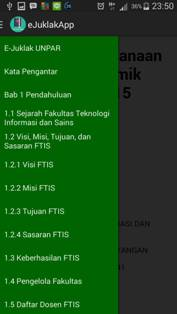
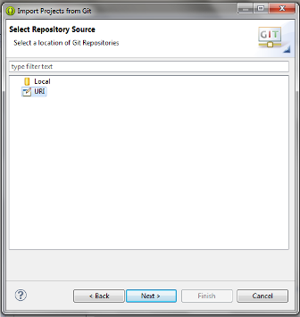
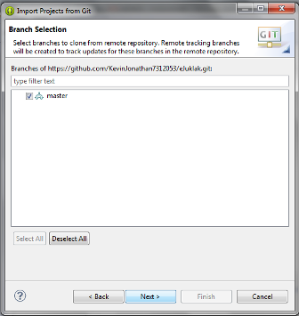
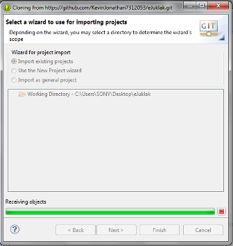
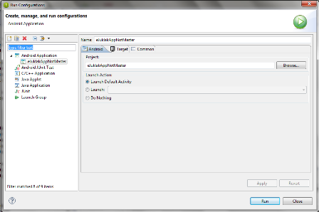
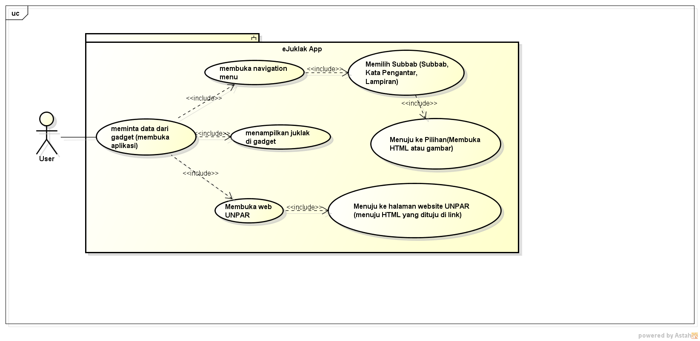
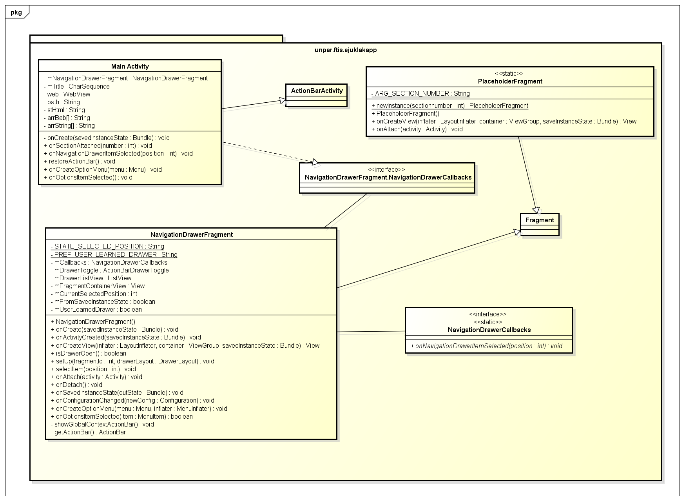

# Dokumentasi  

## Penjelasan Cara Penggunaan Aplikasi  

1. Jalankan Aplikasi di Gadget Anda.  
  *   
2. Setelah membuka aplikasi, pada halaman awal di ujung kiri atas terdapat menu navigasi, di ujung kanan atas terdapat link yang menuju ke web UNPAR.  
  *   
  *   
3. Pada menu navigasi, Anda bisa memilih subbab-subbab yang ada pada eJuklak, lengkap dengan lampiran dan kata pengantar nya, Anda akan langsung diarahkan pada subbab yang dituju.  
  *   
4. Anda juga bisa melihat keseluruhan eJuklak dengan melakukan scroll down pada halaman awal aplikasi.  

## Penjelasan Cara Mem-build Aplikasi dari repositori  

1. Buka eclipse, lalu klik file dan klik import.
  *   
2. Setelah itu pilih Git dan klik "project from git", lalu next.
  *   
3. Pilih URI dan next.
  *   
4. Copy dan Paste link yang terdapat di repositori github, lalu next.
  *   
5. Tetap biarkan master di checklist, lalu next.
  *   
6. Tunggu loading dan sesudah loading selesai klik finish.
  *   
7. Setelah project muncul di eclipse, klik kanan lalu menuju Run dan klik Run as configuration.
  *   
8. Setelah klik Run as configuration akan muncul box yang berisi nama apk lalu klik Run.
  *   

## Penjelasan Struktur Program  

* Use Case Diagram
  *   
* Class Diagram
  * 
  * Main Activity Class
    * Kelas Main Activity sebagai pusat aktivitas pada aplikasi kelompok kami. Di dalam kelas ini memanggil kelas webView yang telah disediakan oleh Java. Kelas ini berguna untuk menampilkan seluruh hasil HTML serta dapat melakukan zoom-in dan zoom-out.
  * Navigation Drawer Fragment
    * Kelas Navigation Drawer Fragment sebagai pembuat navigasi menu drawer. Pada kelas ini hanya di fokuskan untuk mengisi navigasi menu drawer dengan anchor-anchor yang dituju. Menu drawer kelompok kami dapat di klik di sebelah kiri atas layar dan setelah di klik akan muncul anchor-anchor yang diisi di dalam kelas ini.
* Sequence Diagram
  * 
